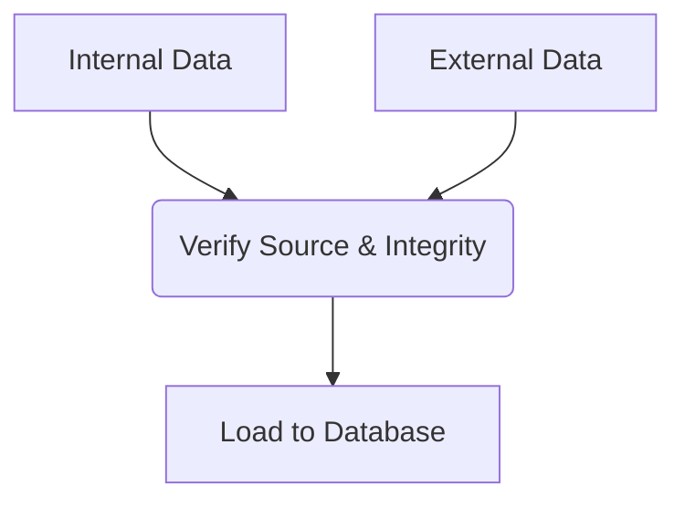
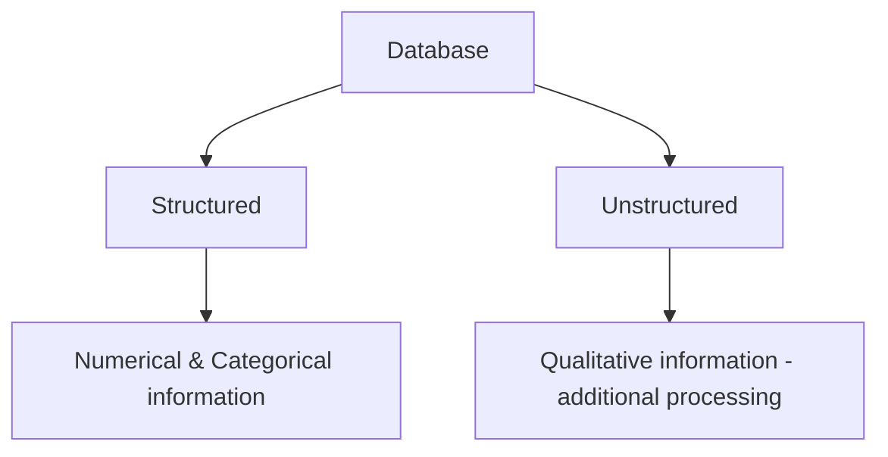
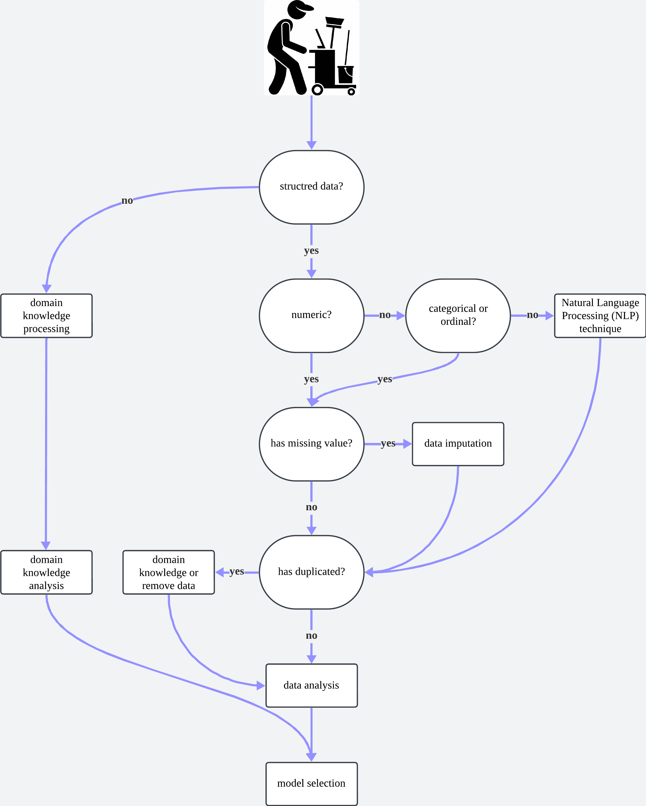
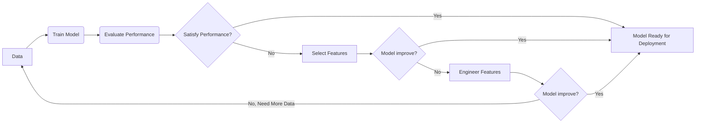
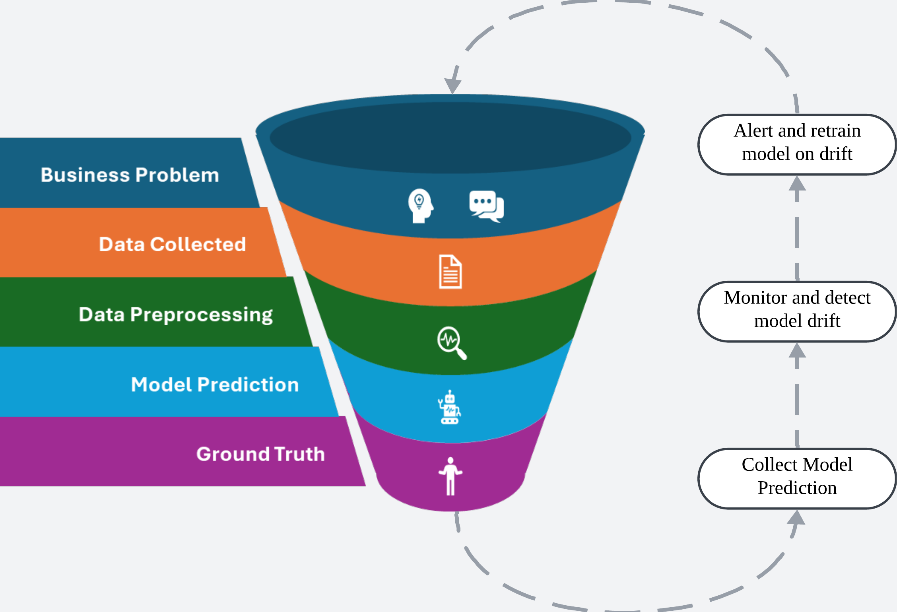
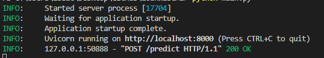
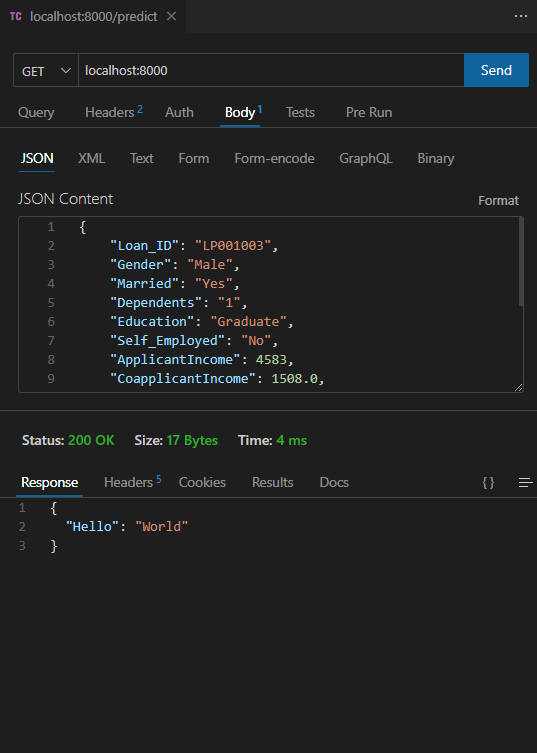
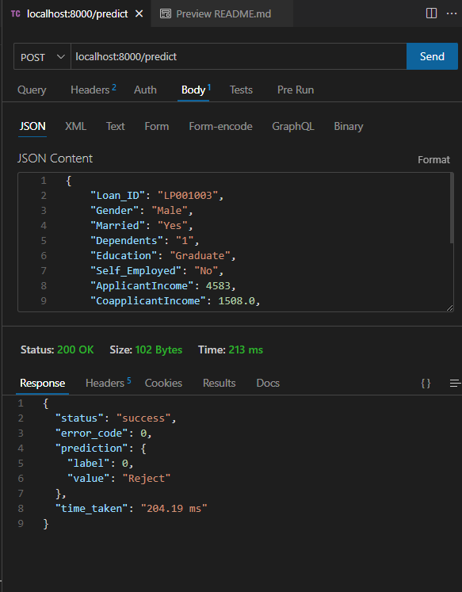

# LoanWiseAI

Imagine you are a machine learning engineer working for a real estate company that wants to build a machine learning system to predict housing prices in a given area. Your goal is to create a model that can accurately predict the price of a house based on various features such as square footage, number of bedrooms and bathrooms, location, and other relevant factors.

<p align="center">
  
</p>

## Understanding Problem

Before diving in, it's crucial to gain a deeper understanding of how each property are evaluated or priced. The real estate market is a complex and dynamic environment. Accurately predicting housing prices is crucial for various stakeholders, including buyers, sellers, and real estate companies.

Key Observations:
Through research and conducted, below are the considered data or feature important for our model.

- Property characteristics: Square footage, number of bedrooms and bathrooms, lot size, year built, presence of renovations, etc.
- Location: Neighborhood, zip code, proximity to amenities (schools, parks, transportation), overall desirability of the area.
- Market factors: Recent sales data in the area, overall market trends, economic indicators.


# Data Collection

## Purpose

Assuming that this is the first time the real estate want to utilized the machine learning system application, this data collection are purely for model training. In addition, it will also be used in data visualization for checking the current state of the company.

## Sources

Let's step into the shoes of a machine learning engineer at LoanWiseAI, a real estate company. Tasked with building a system that accurately predicts housing prices. By analyzing various features like square footage, bedrooms, and location, our model will estimate the value of a home. To train our model, we'll gather data from two main sources:

1. Internal Data Sources:
This treasure trove holds historical records of properties we've listed and sold. It includes details like location (address, zip code, neighborhood), property characteristics (square footage, bedrooms/bathrooms, lot size, year built, renovations), and transaction information (selling price, closing date). Below are the simplified version:
    - Historical company data, extracting historical records of properties listed and sold.
    - Location details (address, zip code, neighborhood).
    - Property characteristics (square footage, number of bedrooms/bathrooms, lot size, year built, renovation details).
    - Transaction information (selling price, closing date).

2. External Data Sources:
While internal data can sometimes be sufficient for model training, external sources often provide valuable supplements.  Here's why:
    - Increased Data Volume: External data can significantly boost the amount of data available for training, leading to a more robust and generalizable model.
    - Enhanced Feature Engineering: Additional data points from external sources can enrich the model's feature set, allowing it to capture a more comprehensive picture of the problem.
    - Data Validation and Understanding: Comparing your model's predictions with external benchmarks or datasets can help validate its performance and identify potential biases in your internal data.

- In essence, incorporating external data is a strategic way to strengthen your model's capabilities and ensure its generalizability. Below are a few example of external data sources:
  - Third-Party Data Providers: Purchasing data from reputable vendors can offer additional details not readily available elsewhere.
  - Government Demographics and Socioeconomic Data: Publicly available datasets from government websites or publications can provide valuable insights into the social and economic landscape of different areas.
  - Web Scraping and APIs: With proper legal and ethical considerations, we can leverage web scraping and free APIs to extract data from other companies' websites.

## Data Storage & Management

**From Spreadsheets to Scalability: Building a Data Foundation**

Given that this is the company's first major data project, it's likely most data currently resides in isolated spreadsheets. While spreadsheets can be convenient for small datasets, they become unwieldy and prone to errors as data volume grows.

The challenge lies in designing a robust data infrastructure for a company embarking on its data journey.  A key factor to consider is the company's willingness to invest in a data-driven approach. Here's where the benefits of a well-chosen database management system (DBMS) come into play.

**Transitioning to a Scalable Solution**

While spreadsheets might seem like a convenient option initially, transitioning to a DBMS becomes essential for long-term success. Here's why:

- Scalability: Spreadsheets have limitations when dealing with large and growing datasets. A DBMS can handle significant data volumes efficiently, ensuring your system scales seamlessly as your data needs evolve.
- Data Integrity: Spreadsheets are susceptible to errors from manual data entry and conflicting versions. A DBMS enforces data integrity through features like data types, constraints, and user permissions, minimizing errors and ensuring data consistency.
- Collaboration and Efficiency: Spreadsheets make collaboration on data analysis cumbersome. A DBMS allows multiple users to access and manipulate data concurrently, streamlining workflows and boosting productivity.
- Advanced Analytics: Spreadsheets offer limited functionality for complex data analysis. A DBMS provides powerful built-in features for data querying, aggregation, and manipulation, facilitating deeper insights from your data.


**Why PostgreSQL Stands Out**

After researching various options, PostgreSQL emerges as a strong candidate due to several key advantages:

- Free and Open-Source: This minimizes initial investment costs, making it an attractive option for companies starting their data journey.
- High Extensibility: PostgreSQL can adapt to accommodate future data growth and evolving needs. It supports a wide range of data types and allows for custom functions and extensions.
- Strong Community Support: A large and active community provides extensive documentation, tutorials, and support, making it easier to learn and manage the system.

Implementing PostgreSQL establishes a solid foundation for the company's data storage needs. This not only empowers data-driven decision-making for the current project but also paves the way for future data-driven initiatives. As the company embraces data analytics, PostgreSQL can scale and adapt to meet their growing needs. In addition, below are a simple dataflow illustration to solidfy the actual process.



# Data Preprocessing

So now with all the data, you gets the general idea of what the data looks like and illustrate it as below.



Now that we have identified all the data, the next step is to roll up our sleeves and dive into cleaning up the mess before training our model. In the field of AI, there is a well-known saying: 'Garbage In, Garbage Out' (GIGO). This emphasizes the critical importance of ensuring high-quality, clean data inputs to produce accurate and reliable outcomes.

**Why Data Cleaning Matters**

Just like building a house requires a solid foundation, training effective AI models requires meticulously cleaned and prepared data. High-quality data is the cornerstone of successful AI models. Data cleaning involves identifying and correcting errors, inconsistencies, and missing values within the dataset.  Imagine training a model with incorrect or incomplete information – the resulting predictions would likely be inaccurate and unreliable. By meticulously cleaning our data, we ensure our models can learn from accurate information, leading to:

- Improved Model Performance: Clean data allows models to identify patterns and relationships more effectively, resulting in better predictions and insights.
- Reduced Bias: Data inconsistencies can introduce bias into models. Cleaning helps eliminate biases and ensures fairer and more reliable outcomes.
- Enhanced Efficiency: Clean data minimizes processing time and resources needed for model training, leading to faster development cycles.
- Investing time and effort in data cleaning is an essential step to maximize the effectiveness of our AI systems.

### Data Janitor

So now you ask yourself, what can I do with this data? How to process the data? Understanding the potential of this data opens up a world of possibilities. You can analyze it to uncover valuable insights, create predictive models for future trends, improve decision-making processes, enhance operational efficiency, and even develop innovative solutions. Processing the data involves steps such as data cleaning, transformation, analysis, and visualization. By harnessing the power of this data through effective processing, you can unlock its full potential and drive meaningful outcomes. Below are the simplest guideline for all data janitor out there:

<p align="center">
  
</p>

When it comes to getting hands-on experience, there are various techniques and approaches that can be explored. However, the focus of this project is not to delve into every technique and approach in detail, but rather to provide a broad overview of the general concepts as simplified below:

- Identifying and handling missing values: Depending on the data type and analysis goals, missing values might need to be imputed, removed, or addressed with specific techniques.
- Correcting errors: Typos, inconsistencies, and formatting errors can be identified and corrected to ensure data integrity.
- Outlier detection and treatment: Identifying and handling outliers, data points that fall significantly outside the expected range, is crucial to avoid skewing the model's results.
- Data transformation: This may involve converting data formats, normalizing values, or creating new features from existing data to improve model performance.

# Model Selection

**From Intuition to Data-Driven Decisions**

Traditionally, real estate professionals have relied on experience and market knowledge to estimate housing prices. While these skills are undeniably valuable, they can be subjective and susceptible to personal biases. This project aims to revolutionize the world of housing price estimation by introducing a more objective approach: the power of machine learning.

**Data Science: The Engine Behind the Machine**

This is where the magic of data science comes into play. Data science is a vast field encompassing a diverse set of techniques and methodologies for extracting knowledge and insights from data. It empowers us to uncover hidden patterns, understand relationships between variables, and ultimately make informed predictions.

**The Data Science Toolkit**

Within the realm of data science, you might encounter terms like Artificial Intelligence (AI), Machine Learning (ML), and Deep Learning (DL). These terms are not interchangeable, but rather represent a spectrum of tools within the data science toolkit, each with its own strengths and applications:

- Artificial Intelligence (AI): A broad field encompassing the creation of intelligent systems that can mimic human cognitive abilities like learning and problem-solving. Machine learning is a subfield of AI.
- Machine Learning (ML): This involves training algorithms to learn from data, allowing them to identify patterns and make predictions without explicit programming. Our housing price estimation model will fall under the umbrella of machine learning.
- Deep Learning (DL): A subfield of machine learning inspired by the structure and function of the human brain. Deep learning models utilize artificial neural networks with multiple layers to process complex data, particularly effective for tasks like image recognition or natural language processing.

In this project, we'll delve into the world of machine learning algorithms to select the most suitable model for predicting housing prices accurately. By leveraging the power of data science, we can move beyond experience-based estimations and embrace a data-driven approach for informed decision-making in the real estate market.

Both Machine Learning (ML) and Deep Learning (DL) can be used to predict house prices, but they have different approaches when it comes to features – the details that influence the prediction.

**Machine Learning Relies on the Classics**

- Imagine an ML model is a detective trying to solve the case of a house price. The detective needs clues – specific features like square footage, number of bedrooms, and neighborhood – to narrow down the suspect (the price).
- Selecting the right features beforehand is crucial for ML models, just like giving the detective the most relevant evidence for a successful investigation.

**Deep Learning: The Sherlock Holmes of Features**

- Deep Learning models are more like the brilliant detective Sherlock Holmes. They can not only analyze the classic clues (features) but also uncover hidden patterns within the data itself.
- Think of feeding the model a vast amount of real estate data, including photos, descriptions, and historical sales figures. The model can then identify features you might not have considered, like the architectural style or the presence of nearby parks, that influence the price.

**Building a Better Picture: Feature Engineering**

Another important concept is feature engineering. This involves transforming or combining existing data to create new features that might be more informative. Both ML and DL can benefit from feature engineering. For example, you might create a new feature combining square footage and number of bedrooms to represent "living space per person," which could be a more relevant factor for determining value. Since we are focusing on ML, below are my general rule of thumb when doing feature selection and feature engineering.



### Real Estate Price Prediction: A Regression Problem

Our goal is to predict a continuous value – the selling price of a house. This characteristic makes housing price prediction a perfect example of a regression problem. In regression analysis, we build models to identify relationships between a target variable (selling price) and a set of predictor variables (property features and location).

**Regression Applications Powering Real Estate Decisions**

This project can unlock valuable applications for the real estate company through the power of regression modeling:

- Market Value Estimation: We can develop a model to predict the fair market value of a property. This can be instrumental in tasks like appraisals or setting competitive listing prices that are aligned with market trends.
- Price Trend Forecasting: By analyzing historical data, our model can forecast future trends in housing prices for specific areas. This information can be crucial for informing investment decisions and developing data-driven market strategies.

**Evaluating Our Predictive Power: Regression Metrics**

To assess the performance of our housing price prediction model, we'll utilize a combination of regression evaluation techniques. Here are some key metrics we'll focus on:

- Mean Squared Error (MSE): This metric measures the average squared difference between the predicted prices and the actual selling prices. Lower MSE values indicate a better model, as they represent smaller prediction errors on average.
- Root Mean Squared Error (RMSE): The RMSE is the square root of MSE. It expresses the average prediction error in the same units as the selling price (e.g., dollars), making it easier to interpret the magnitude of errors.
- Mean Absolute Error (MAE): This metric calculates the average absolute difference between predicted and actual selling prices. Unlike MSE, MAE is less sensitive to outliers in the data, providing a more robust measure of prediction error.
- R-squared: R-squared represents the proportion of the variance in selling prices that can be explained by the features considered in the model. Values closer to 1 indicate a better fit, meaning the model's features effectively capture the factors influencing house prices.

Leveraging the insights from the regression evaluation metrics (MSE, RMSE, MAE, R-squared) is key to selecting the optimal model for our needs. Here's a two-step approach we can employ:

1. Model Training and Evaluation:

    - We will train and evaluate a variety of machine learning models suitable for regression problems.
    - During training, each model will learn from the historical data, identifying patterns and relationships between the features and the selling price.
    - After training, we will use the regression evaluation metrics on a separate hold-out dataset (data not used for training) to assess each model's performance. This helps prevent overfitting, where the model performs well on the training data but poorly on unseen data.

2. Selecting the Best Performer:

- By comparing the evaluation metrics across all trained models, we can identify the one that achieves the best balance of:
  - Low Error: As indicated by MSE and RMSE, we want a model with minimal prediction errors.
  - Robustness: As measured by MAE, the model should be less sensitive to outliers in the data.
  - Explanatory Power: A high R-squared value signifies that the model's features effectively capture the factors influencing house prices, or in other word it represent how the data fit the model @ goodness of fit.


# Deployment & Monitoring

Congratulations! You've built an amazing model that acts like a super-smart assistant for your real estate agents. It helps them understand the market, predict trends, and connect potential buyers with their dream homes. But just like any good assistant, this model needs some ongoing care to stay effective.

**Getting Your Assistant Out There: Deployment Strategies**

Think about it like launching a new product for your agents. We need a deployment strategy to ensure a smooth transition. Here are a couple of options:

- Canary Deployment: This is like a test run with a small group of agents first. If everything works well, it gradually rolls out to everyone, minimizing any potential hiccups.
- Blue-Green Deployment: Imagine having two identical systems – one with the old model, one with the new. You switch agents to the new system only if everything is functioning properly on the "green" side, minimizing downtime.
- Environment Configuration: Before launch, we need to set up different environments for the app, like a "practice room" (development), a "dress rehearsal stage" (staging), and the "live performance stage" (production). We configure each environment to ensure the app runs smoothly.
- CI/CD: Imagine a system that automatically checks and updates your app whenever you make improvements.  CI/CD (Continuous Integration/Continuous Deployment) automates the deployment process, ensuring quick and efficient rollouts of new features and updates.
- Version Control: Just like keeping track of different drafts of a document, we use version control to track changes made to the app. This allows us to go back to a previous version if needed.
- Deployment Tools: Imagine placing your app in a secure container for easy transport. We use containerization (like Docker) or serverless computing (like AWS Lambda) to package the app and its dependencies for deployment, making it easy to move between environments.

**Keeping Your Smart Assistant Sharp: Like Updating Your Favorite Recipe! (Model Monitoring)**

Imagine your favorite recipe – the one for those delicious cookies everyone loves. But over time, ingredient prices change, ovens get better, and maybe even your taste buds evolve!  The same thing happens with real estate data – trends shift, markets fluctuate, and new factors come into play.

To keep your super-smart assistant (like a loan predictor model) helpful for real estate agents, we need to monitor it and make adjustments just like you would update your recipe. Following are stratergy we can employ:

- Performance Check: Think of this as checking how accurately model able to predict upcoming prices or even houses rise prices. We continuously monitor the model's speed and accuracy to ensure it's running smoothly and meeting expectations.
- Data Drift Watch: Imagine if interest rates suddenly jumped! We track the data the model uses, like market trends and property details, to see if anything significant changes. If so, we might need to "re-train" the model with fresh data to keep its predictions on target.
- Model Output Analysis: We see how the model performs on new data, like analyzing upcoming listings. If the model's predictions about pricing or buyer interest become unreliable, we might need to adjust its settings based on current market conditions.
- Alert System: Imagine an alert system that notifies agents if a new listing perfectly matches a client's needs. We set up alerts to warn us if the model's performance falls outside expected ranges, indicating potential issues requiring investigation.
- Learning Logs: We keep a record of the model's predictions, the data it analyzes (property details, market trends), and the outcomes (accurate predictions, missed opportunities). This is like keeping track of what worked well in your real estate strategies for future reference!
- Security First: We constantly check for vulnerabilities, like making sure your company's data remains secure. This ensures the model is protected from unauthorized access.
- Feedback Loop: We listen to feedback from agents using the model and from the monitoring systems themselves. This helps us continuously improve the model and how it integrates with agents' workflows, leading to a more effective real estate experience.

For more illustration on model monitoring, refer below diagram

<p align="center">
  
</p>


# Loan Predictor

**Beyond Price Prediction: Empowering Clients with Loan Approval Insights**

Helping clients secure their dream home is at the heart of our business. While accurate price prediction plays a crucial role, another critical factor is ensuring their loan application success.  This is where building a loan predictor model comes in.

## Building a Client-Centric Model

The model will analyze data from clients who apply for loans. This data might include factors such as:
- Gender
- Married
- Dependents
- Education
- Applicant Income
- Co applicant Income
- Loan Amount
- Loan Amount Term
- Credit History
- Property Area

## Deployment Safeguard

Fast foward to the future, we successfully built and trained your loan predictor model!  Excitement is high, and the potential to empower both agents and clients is undeniable.  However, before unleashing this powerful tool, a crucial step remains: ensuring its robustness and reliability.

**Running a Targeted API Test**

To achieve this, we will strategically design an API test.  An API (Application Programming Interface) acts as a bridge between your model and the application your agents will use. Testing the API ensures smooth communication between the model and the user interface, guaranteeing data flows seamlessly and predictions are delivered accurately.

**Testing the Loan Predictor Model: Setting Up a Local Test Environment**

In this phase, we are preparing to thoroughly evaluate the performance of our loan predictor model. Picture it as a pristine vehicle fresh from the production line. Before unleashing it on the open road, we must first conduct a test drive in a secure, controlled setting. This is where our local machine plays a crucial role.
We will transform our machine into a temporary server, enabling the model to operate and handle requests. To initiate this testing process, we will utilize a familiar companion: localhost, also recognized as 127.0.0.1. Consider it a unique address that directly connects to our local machine. By combining this address with the specific endpoint (the distinct path within our application that interacts with the model), we can transmit test data and observe the model's responses.
This local test scenario serves as a valuable opportunity to detect and address any potential communication issues between the model and the user interface before rolling it out to a broader audience. It's akin to conducting a thorough tune-up on the car before allowing everyone to experience its performance firsthand.

## File Directory

```
project
│   README.md
│   input.json
|   main.py
|   model.pkl  
│
└───src
│   │   schema.py
│   │
│   
└───res
    │   ..
```

To run our API service smoothly, the key element is the 'main.py' file. This file is responsible for serving our model stored in 'model.pkl'. Within the 'src' folder, we have the 'schema.py' file, which defines the input and output of our API. To keep things simple, I have integrated the data preprocessing steps into the schema file instead of the 'main.py'. This setup allows us to easily modify the schema structure by adjusting or referencing the preprocessing steps whenever needed.

## Quickstart

1. Fire Up Virtual Environment

To initiate the virtual environment using the requirements.txt file, it appears that there have been some unidentified changes as of today (2024-03-23). Therefore, it is recommended to install the following packages:

  - fastapi
  - uvicorn
  - pandas
  - numpy
  - scikit-learn==1.2.2

Either install using conda or other tools is up to you. However, it is strongly recommended to opt for Anaconda for its comprehensive package management and environment capabilities. After firing up your environment, change the working directory to the current project file.

2. Fire Up API
Then within the same environment, you can either type 'python main.py' directly to the anaconda cmd or open up your VScode and run it throught terminal. There are several changes been done to the 'main.py' so that we can run it like pythonic method.

If you run it through VScode, you should see something like this:

<p align="center">
  
</p>

Based on details, we can see that currently we can access the parent API through localhost:8000.

3. Proof Of Concept

**Hello World**

So now assumed that you familiar with the code or FastAPI, we can use any API client we want, here I use Thunder Client which intergrated inside VScode. Below shows more on how we using Thunder Client in testing the API.

<p align="center">
  
</p>

There are several thing need to be explain here, the first is the IP or the API end point which in the 'main.py'. In localhost:8000, we specifically will return the json hello world via GET request. The response can be seen on the bottom part of the picture. For the 'JSON Content' part on the picture will be used onto testing our ML API later.

**Machine Learning API**

For testing our ML API, the need to add paramater to our endpoint from localhost:80000 to localhost:8000/predict. The to understand the endpoint of '/predict', head to 'main.py' and read the comment which was written. In addition, instead of using GET, here we are using POST.

<p align="center">
  
</p>

We will parse the first input from 'input.json' file which shown in the 'JSON Content' part in the picture. The once we hit the 'Send' button, we will received following output as shown in the 'Response' part. There, we extracted the status, error_code, prediction, and time taken.


# Issues
While the API seems to be working now, this API only consider for 1 input of JSON content for now. In addition, the time parameter is simply by taking the time taken for the operation in 'main.py' to complete. It does not consider the time taken for the whole sequence of time where time of information relay between port or devices. Lastly, there is more than what we can do with pydantic especially with error handling, right now due to limited time and knowledge, not all error are tested. In addition, we should consider a better pipeline for preprocessing such as scikit-learn pipeline.

Cheers.